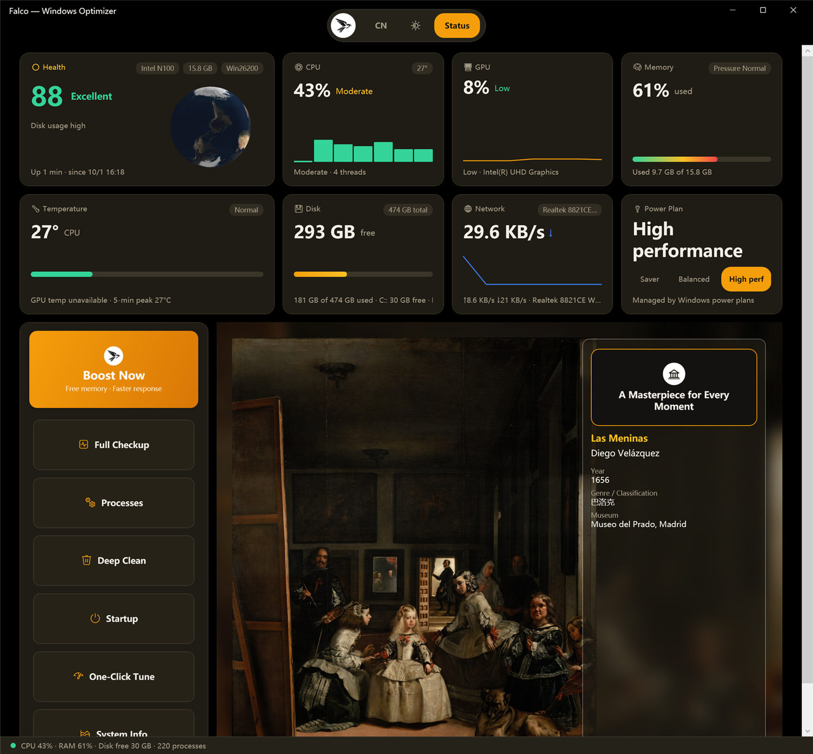
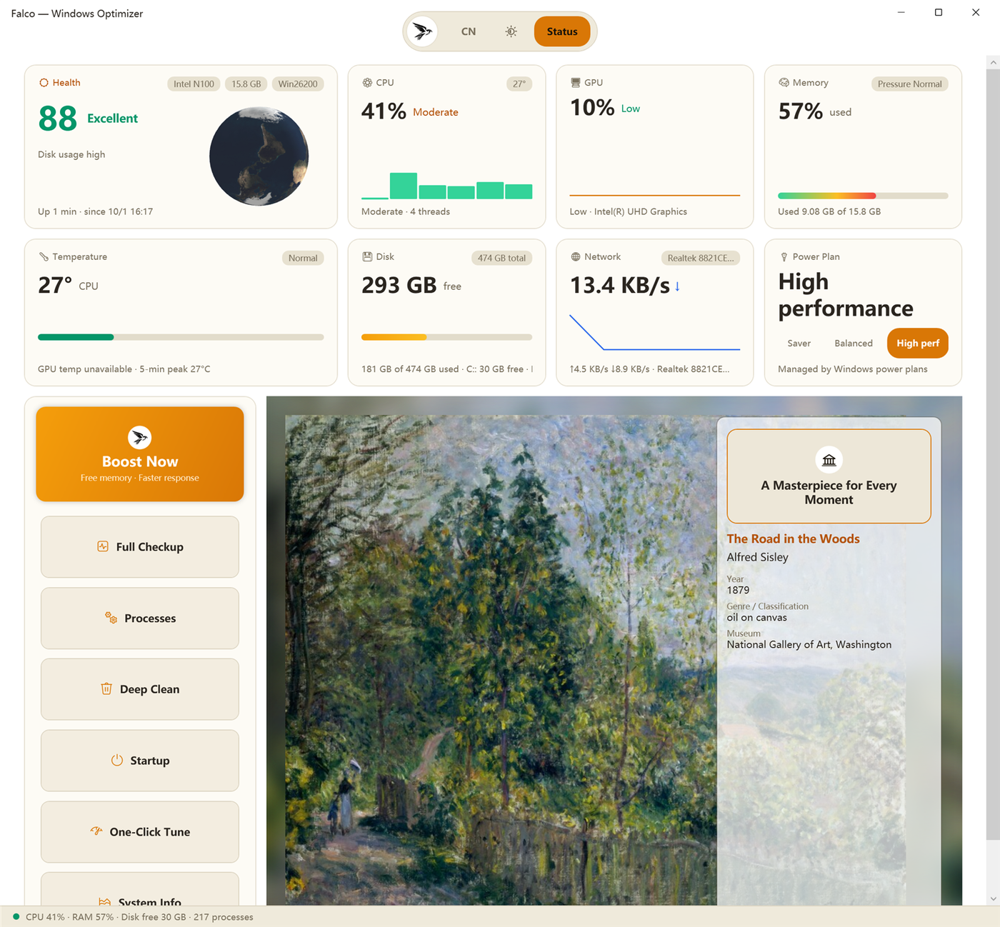

# Falco

English | [简体中文](./README.zh-CN.md)

[](./LICENSE)
[](../../releases)
[](https://dotnet.microsoft.com/download/dotnet/8.0)

**Falco** is an open-source maintenance toolkit for Windows 10/11, in two editions that share one philosophy: **every change is backed up, and everything can be undone.**

| | [Falco GUI](#falco-gui) | [Falco CLI](#falco-cli) |
|---|---|---|
| Form | Desktop app (C#/WPF, .NET 8) | Single-file PowerShell script |
| Best for | Everyday use — one glance, one click | Scripts, quick checks, automation |
| License | GPL-3.0 | GPL-3.0 |
| Get it | [Installer from Releases](../../releases) or [build from source](#build-from-source) | `git clone` and run |

| Dark theme | Light theme |
|---|---|
|  |  |


## Falco GUI

- **Status dashboard** — health score (0–100), CPU / GPU / memory / disk / network live charts, CPU & GPU temperature, top processes
- **Boost Now** — frees memory by trimming process working sets; running programs are unaffected
- **Full Checkup** — ten-point inspection with a weighted score and fix suggestions
- **Deep Clean** — temp files, caches, leftover installs — deletions go to the Recycle Bin
- **Startup manager** — enable / disable / remove, with backup
- **One-Click Tune** — six system tweaks (Delivery Optimization, background apps, visual effects, active hours, SysMain, Windows Search) with read-back verification and automatic rollback
- **System analysis** — services and large-file scanning
- **World Art Gallery** — a rotating showcase of 50 of the world's most famous public-domain paintings, fetched from museum open-access imagery (NGA, Wikimedia Commons)
- **Falcon badge menu** — settings (language, theme, launch at startup), about, update check
- **Dark & light themes · 中文 / English UI**

## Falco CLI

- `status` — health score plus a CPU / memory / disk / temperature / uptime snapshot; `-Json` for machine-readable output
- `tweaks` — inspect, back up, apply and revert the same six system tweaks; every write is read-back verified and rolled back on failure
- `clean` — scan and clean temp files / Windows Update cache / thumbnail cache / Recycle Bin
- `purge` — scan for build artifacts (`node_modules` / `target` / `build`…); skips anything active within 7 days, containing secrets, or inside nested repositories
- `large` — large-file scan

```powershell
# System status & health score
powershell -ExecutionPolicy Bypass -File .\Falco-CLI.ps1 status -Json

# Apply the four low-risk tweaks
powershell -ExecutionPolicy Bypass -File .\Falco-CLI.ps1 tweaks apply safe

# Clean temp files and thumbnail caches
powershell -ExecutionPolicy Bypass -File .\Falco-CLI.ps1 clean run -Items temp,thumbs -Yes

# Scan a drive for build artifacts and large files
powershell -ExecutionPolicy Bypass -File .\Falco-CLI.ps1 purge D:\code -Days 7
powershell -ExecutionPolicy Bypass -File .\Falco-CLI.ps1 large C:\ -MinMB 500 -Top 20
```

Full command reference: [User-Guide.md](./User-Guide.md) · [中文指南](./使用指南.md)

## Build from source

**Falco GUI** — requires the [.NET 8 SDK](https://dotnet.microsoft.com/download/dotnet/8.0) on Windows:

```powershell
# Self-contained, ReadyToRun-compiled portable app
dotnet publish src/Falco.App/Falco.App.csproj -c Release -r win-x64 --self-contained true -p:PublishReadyToRun=true -o src/Falco.App/release
```

Run `src\Falco.App\release\Falco.exe` — no runtime dependencies. To build a signed-in-Stone installer, install [Inno Setup 6](https://jrsoftware.org/isinfo.php) and run:

```powershell
powershell -ExecutionPolicy Bypass -File .\Build-2.0.ps1 -Version 2.4.9
```

**Falco CLI** — no build step; clone and run. Temperature readings use the bundled [LibreHardwareMonitor](https://github.com/LibreHardwareMonitor/LibreHardwareMonitor) (`lib/`, optional) and fall back to the ACPI thermal zone without it.

## Notes

- Reading CPU temperature requires running as administrator — a Windows security mechanism, not a Falco limitation. Without admin rights the dashboard explains this inline.
- Installers are not code-signed yet: when SmartScreen appears, choose "More info" → "Run anyway".
- Every tweak/clean/change is backed up to `C:\ProgramData\Falco\Backups` with a `Restore-Falco.ps1` script before it is applied.

## Project structure

```
Falco/
├── Falco-CLI.ps1                 # CLI edition — self-contained PowerShell script
├── User-Guide.md / 使用指南.md    # CLI user guide (EN / 中文)
├── lib/LibreHardwareMonitor/     # Optional sensor library for the CLI (MPL-2.0)
├── assets/                       # GUI build assets (app icon, earth textures, NGA open-data index)
├── src/Falco.App/                # GUI edition — C#/WPF (.NET 8) source
│   ├── Views/                    #   Pages and dialogs
│   ├── Services/                 #   Metrics, tweaks, cleaning, museum APIs, update check
│   ├── Resources/                #   Theme dictionaries + zh/en UI strings
│   └── Falco.App.csproj
├── Falco-Setup-2.0.iss           # Inno Setup installer script for the GUI
├── Build-2.0.ps1                 # One-shot build: version bump → publish → installer
└── LICENSE                       # GPL-3.0
```

## License

Falco is licensed under the [GPL-3.0](./LICENSE).

The bundled [LibreHardwareMonitorLib](https://github.com/LibreHardwareMonitor/LibreHardwareMonitor) (v0.9.6, `lib/LibreHardwareMonitor/`) is licensed under the **Mozilla Public License 2.0 (MPL-2.0)** and remains a separate, optional sensor provider: those files keep their original license and notices (see `lib/LibreHardwareMonitor/NOTICE.txt`) and are not affected by this project's GPL-3.0 terms.

Artwork shown in World Art Gallery is public-domain imagery from museum open-access programs (National Gallery of Art open data, Wikimedia Commons).

## Disclaimer

Falco modifies system registry settings and service configurations. Although every change is backed up and reversible, you should:

1. Create a system restore point before first use
2. Keep your own backups of important data
3. Restart the system after restoring defaults

Use at your own discretion.
